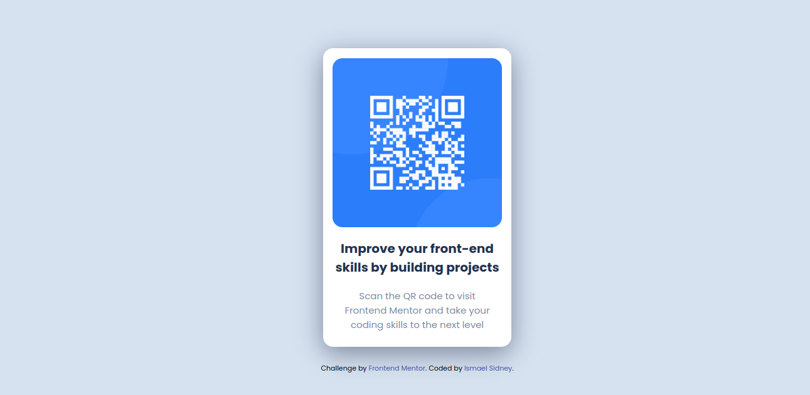

# Frontend Mentor - QR code component solution

Minha solução para o desafio [QR code component challenge on Frontend Mentor](https://www.frontendmentor.io/challenges/qr-code-component-iux_sIO_H). O desafio se resume em criar card onde tem uma imagem de QR code, um titulo e um texto, seguindo as imagens de referência do desafio.

### Screenshot da minha implementação

### Links

- URL github pages: [Link para visualizar a página](https://ismaelsidney.github.io/QrCodeChallengeFrontEndMentor/)

### Construido com:

- HTML5
- CSS

